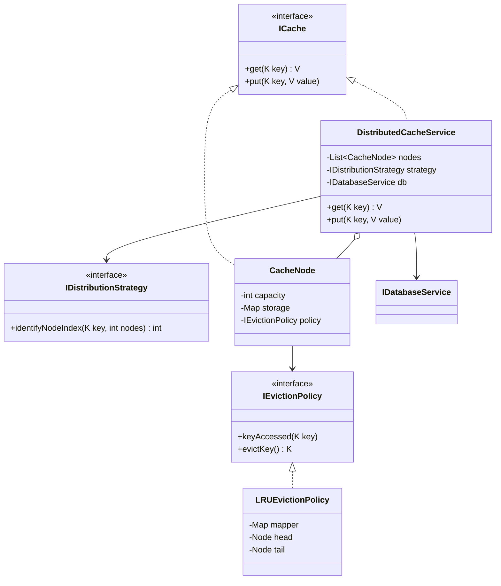

# Distributed Cache System (LLD)

A robust, extensible, and SOLID-compliant implementation of a Distributed Cache system. This system allows for pluggable distribution strategies and eviction policies, ensuring scalability and maintainability.

## Problem Description

The goal is to design a system that manages a cache distributed across multiple nodes. The system must support:
- **`get(key)`**: Retrieves from cache or falls back to a Database if it's a "cache miss".
- **`put(key, value)`**: Determines the correct node using a distribution strategy and stores the data, evicting old data if capacity is reached.

## Solution Explanation

### 1. Data Distribution
The system uses the **Strategy Pattern** for node routing. 
- **Modulo-based Distribution**: The `HashModuloDistributionStrategy` uses `Math.abs(key.hashCode()) % numberOfNodes` to determine the target node.
- **Extensibility**: The `IDistributionStrategy` interface allows for future implementations like **Consistent Hashing** without modifying the core cache logic.

### 2. Cache Miss Handling
The `DistributedCacheService` acts as a **Facade**. 
- When a `get` call result in `null` from the target node, the service calls the `IDatabaseService`.
- The fetched value is then "lazy-loaded" into the appropriate cache node to speed up subsequent requests.

### 3. Eviction Mechanism
Each `CacheNode` manages its own capacity and eviction.
- **LRU (Least Recently Used)**: Implemented via `LRUEvictionPolicy` using a Doubly Linked List and a HashMap for $O(1)$ updates and evictions.
- **Extensibility**: The `IEvictionPolicy` interface allows swapping LRU for **LFU** or **MRU** easily.

## Design Patterns Used

- **Strategy Pattern**: Used for both Distribution and Eviction policies.
- **Facade Pattern**: `DistributedCacheService` simplifies the complex distributed operations into a single interface.
- **Dependency Inversion**: High-level modules depend on abstractions (interfaces), not low-level implementations.

## UML Class Diagram



## How to Run

1.  Navigate to the `distributed-cache` directory.
2.  Compile the source:
    ```bash
    javac -d bin -sourcepath src src/com/example/cache/Main.java
    ```
3.  Execute the demonstration:
    ```bash
    java -cp bin com.example.cache.Main
    ```
