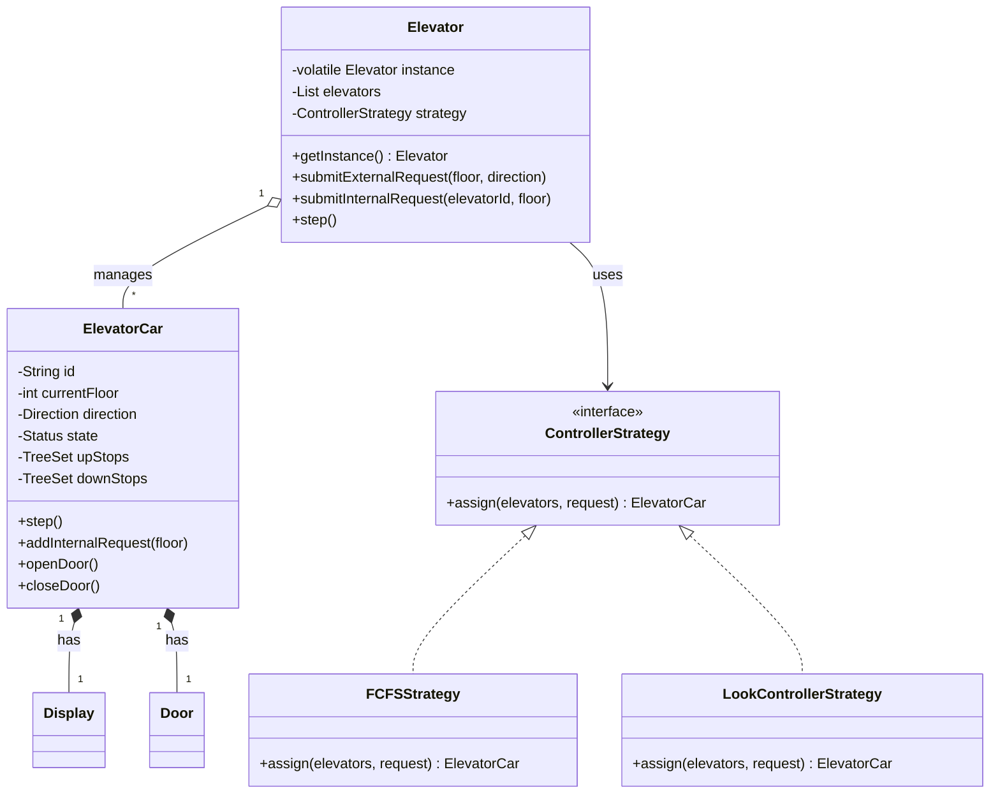

# Elevator System Design (LLD)

## Problem Statement
Design a system to control multiple elevators in a building that efficiently handles both external (floor calls) and internal (destination selection) requests. The system must support various scheduling strategies and incorporate safety features like load sensors.

## Features
- **Singleton Pattern**: The core system is managed by a single, thread-safe `Elevator` instance.
- **Strategy Pattern**: Supports dynamic switching between scheduling algorithms (FCFS and Look/SSTF).
- **Concurrency & Safety**: Thread-safe state management and automated sensor-driven safety interrupts (weight limits).
- **Observer Pattern**: A dedicated `Sensor` observer system for real-time monitoring.

## System Design (UML)



## How to Run:

1. **Compile the source files**:
   ```bash
   javac SST28-LLD101/elevator-design/src/com/example/elevator/*.java
   ```

2. **Run the simulation**:
   ```bash
   java -cp SST28-LLD101/elevator-design/src com.example.elevator.Main
   ```
