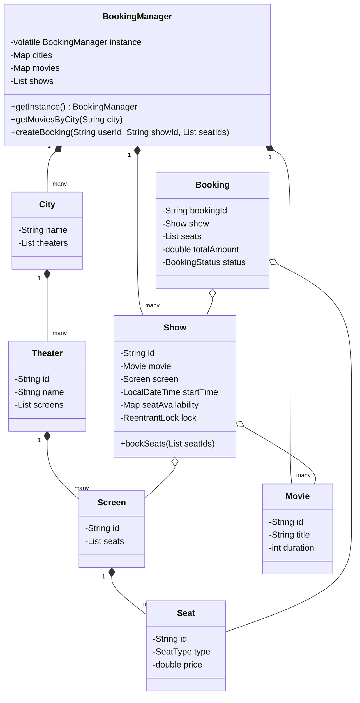

# Movie Ticket Booking System - LLD Design

## Problem Statement
Design a system that allows customers to search for movies and theaters in a city, view available shows/seats, and book tickets. Simultaneously, administrators can manage movies, theaters, and schedule shows. The system must handle concurrent booking attempts for the same seats efficiently.

## Features
- **Singleton Pattern**: The `BookingManager` uses a thread-safe, double-checked locking mechanism to ensure a single global state.
- **Seat Tiering**: Support for various seat categories (Silver, Gold, Platinum) with dynamic pricing.
- **Concurrency Control**: Utilizes `ReentrantLock` at the `Show` level to prevent double-booking, ensuring that seat availability is correctly maintained across multiple concurrent sessions.
- **API Interfaces**: Cleanly separated Customer and Admin functionalities.

## System Design (UML)



## How to Run:

1. **Compile the code**:
   ```powershell
   javac SST28-LLD101/movie-ticket-booking/src/com/example/booking/*.java
   ```

2. **Run the simulation**:
   ```powershell
   java -cp SST28-LLD101/movie-ticket-booking/src com.example.booking.Main
   ```
