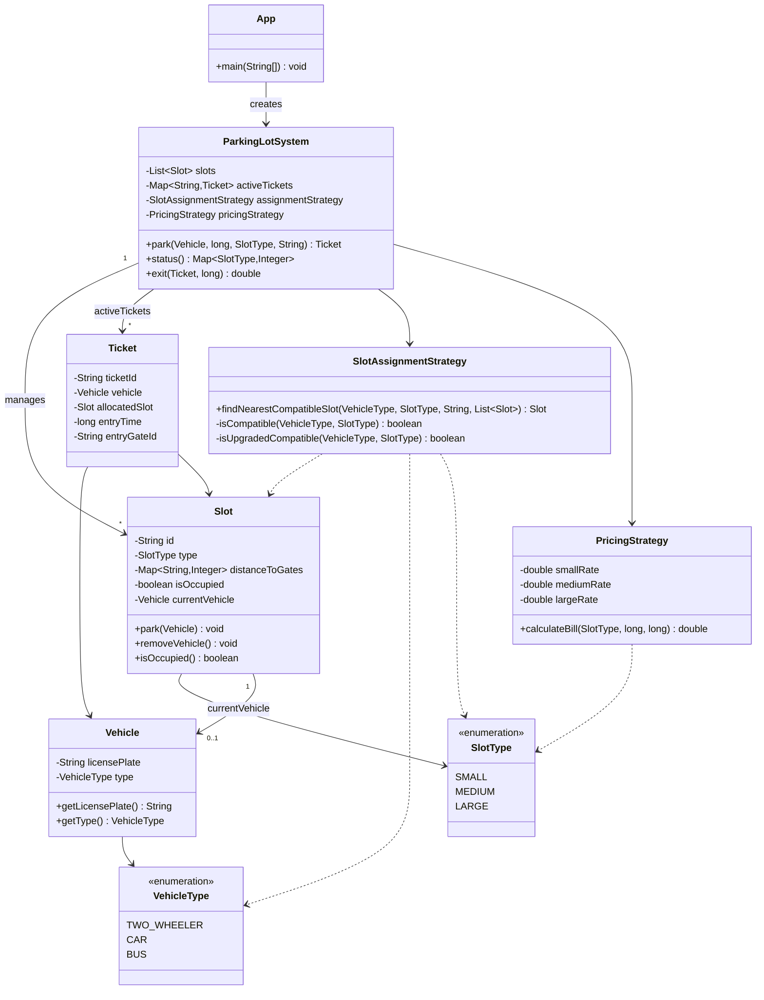

# Class Diagram — Multilevel Parking Lot

```mermaid
classDiagram
    class SlotType {
        <<enumeration>>
        SMALL
        MEDIUM
        LARGE
    }

    class VehicleType {
        <<enumeration>>
        TWO_WHEELER
        CAR
        BUS
    }

    class Vehicle {
        -String licensePlate
        -VehicleType type
        +getLicensePlate() String
        +getType() VehicleType
    }

    class Slot {
        -String id
        -SlotType type
        -Map~String,Integer~ distanceToGates
        -boolean isOccupied
        -Vehicle currentVehicle
        +park(Vehicle) void
        +removeVehicle() void
        +isOccupied() boolean
    }

    class Ticket {
        -String ticketId
        -Vehicle vehicle
        -Slot allocatedSlot
        -long entryTime
        -String entryGateId
    }

    class PricingStrategy {
        -double smallRate
        -double mediumRate
        -double largeRate
        +calculateBill(SlotType, long, long) double
    }

    class SlotAssignmentStrategy {
        +findNearestCompatibleSlot(VehicleType, SlotType, String, List~Slot~) Slot
        -isCompatible(VehicleType, SlotType) boolean
        -isUpgradedCompatible(VehicleType, SlotType) boolean
    }

    class ParkingLotSystem {
        -List~Slot~ slots
        -Map~String,Ticket~ activeTickets
        -SlotAssignmentStrategy assignmentStrategy
        -PricingStrategy pricingStrategy
        +park(Vehicle, long, SlotType, String) Ticket
        +status() Map~SlotType,Integer~
        +exit(Ticket, long) double
    }

    class App {
        +main(String[]) void
    }

    Vehicle --> VehicleType
    Slot --> SlotType
    Slot "1" --> "0..1" Vehicle : currentVehicle
    Ticket --> Vehicle
    Ticket --> Slot
    PricingStrategy ..> SlotType
    SlotAssignmentStrategy ..> Slot
    SlotAssignmentStrategy ..> VehicleType
    SlotAssignmentStrategy ..> SlotType
    ParkingLotSystem "1" --> "*" Slot : manages
    ParkingLotSystem "1" --> "*" Ticket : activeTickets
    ParkingLotSystem --> SlotAssignmentStrategy
    ParkingLotSystem --> PricingStrategy
    App --> ParkingLotSystem : creates
```
