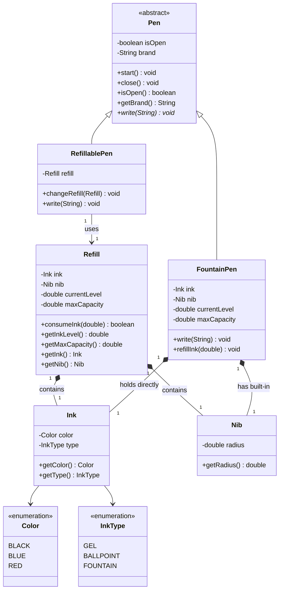

# Class Diagram — Pen Design LLD

```mermaid
classDiagram
    class Color {
        <<enumeration>>
        BLACK
        BLUE
        RED
    }

    class InkType {
        <<enumeration>>
        GEL
        BALLPOINT
        FOUNTAIN
    }

    class Ink {
        -Color color
        -InkType type
        +getColor() Color
        +getType() InkType
    }

    class Nib {
        -double radius
        +getRadius() double
    }

    class Pen {
        <<abstract>>
        -boolean isOpen
        -String brand
        +start() void
        +close() void
        +isOpen() boolean
        +getBrand() String
        +write(String) void*
    }

    class Refill {
        -Ink ink
        -Nib nib
        -double currentLevel
        -double maxCapacity
        +consumeInk(double) boolean
        +getInkLevel() double
        +getMaxCapacity() double
        +getInk() Ink
        +getNib() Nib
    }

    class RefillablePen {
        -Refill refill
        +changeRefill(Refill) void
        +write(String) void
    }

    class FountainPen {
        -Ink ink
        -Nib nib
        -double currentLevel
        -double maxCapacity
        +write(String) void
        +refillInk(double) void
    }

    Pen <|-- RefillablePen
    Pen <|-- FountainPen

    RefillablePen "1" --> "1" Refill : uses
    Refill "1" *-- "1" Ink : contains
    Refill "1" *-- "1" Nib : contains

    FountainPen "1" *-- "1" Ink : holds directly
    FountainPen "1" *-- "1" Nib : has built-in

    Ink --> Color
    Ink --> InkType
```
