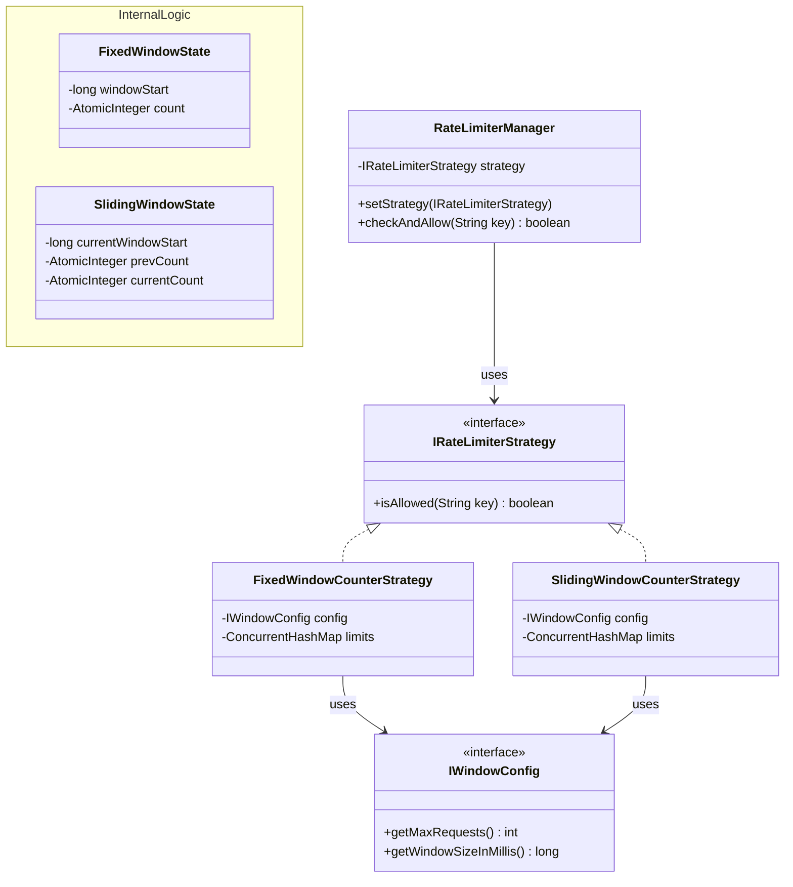

# Rate Limiting System (LLD)

A robust, extensible, and thread-safe implementation of a Pluggable Rate Limiting System designed to control external resource usage based on dynamic keys (e.g., user, tenant, API key).

## Problem Description

External resources cost money and compute power. We need to conditionally block internal services from aggressively calling external APIs. The limit criteria might vary depending on business logic. 
- A given entity (like `user:T1`) should only be allowed `X` requests per `Y` time window.
- The algorithm used to track rate limits should be interchangeable.

## Solution Explanation

### Pluggability (Strategy Pattern)
The core logic for granting/denying a request is abstracted into `IRateLimiterStrategy`.
The `RateLimiterManager` acts as the context, holding the current strategy. This allows the internal services to just call `manager.checkAndAllow(key)` without knowing the underlying math.

### Algorithms Implemented

1. **Fixed Window Counter:**
   - Tracks requests occurring in discrete, fixed time boundaries (e.g., `12:00:00 - 12:00:59`).
   - *Pros:* Extremely lightweight in memory, very fast.
   - *Cons:* Susceptible to **boundary bursts**. A client can send max traffic at the very end of one window, and max traffic at the very beginning of the next, effectively doubling the rate momentarily.

2. **Sliding Window Counter:**
   - Evaluates a weighted average using the previous window and the current window to estimate traffic smoothly over a rolling timeframe.
   - *Pros:* Solves the boundary burst problem without requiring a massive memory footprint like the Sliding Log algorithm.
   - *Cons:* Slightly more math-intensive per request. Assumes that traffic in the previous window was evenly distributed.

### Concurrency and Thread Safety
Given that rate limiters suffer from heavy multi-threaded contention (many API calls simultaneously checking limits), standard `synchronized` blocks create severe bottlenecks.
This design uses **optimistic locking** and highly concurrent collections:
- `ConcurrentHashMap` combined with the `.compute()` method ensures atomicity per-key without locking the entire map.
- `AtomicInteger` ensures thread-safe incrementing/decrementing.

## UML Class Diagram



## How to Run the Simulation

1.  Navigate to the `rate-limiter` directory.
2.  Compile the source:
    ```bash
    javac -d bin -sourcepath src src/com/example/ratelimiter/Main.java
    ```
3.  Execute the demonstration:
    ```bash
    java -cp bin com.example.ratelimiter.Main
    ```
The output will prove that limits are enforced accurately, algorithm switches work flawlessly, and most importantly, concurrency stress-tests pass successfully!
