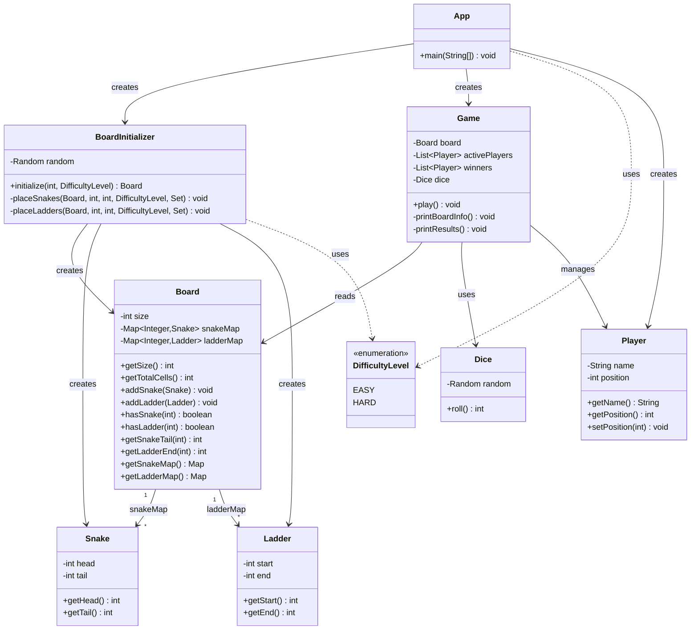

# Class Diagram — Snakes & Ladders

```mermaid
classDiagram
    class DifficultyLevel {
        <<enumeration>>
        EASY
        HARD
    }

    class Snake {
        -int head
        -int tail
        +getHead() int
        +getTail() int
    }

    class Ladder {
        -int start
        -int end
        +getStart() int
        +getEnd() int
    }

    class Player {
        -String name
        -int position
        +getName() String
        +getPosition() int
        +setPosition(int) void
    }

    class Board {
        -int size
        -Map~Integer,Snake~ snakeMap
        -Map~Integer,Ladder~ ladderMap
        +getSize() int
        +getTotalCells() int
        +addSnake(Snake) void
        +addLadder(Ladder) void
        +hasSnake(int) boolean
        +hasLadder(int) boolean
        +getSnakeTail(int) int
        +getLadderEnd(int) int
        +getSnakeMap() Map
        +getLadderMap() Map
    }

    class Dice {
        -Random random
        +roll() int
    }

    class BoardInitializer {
        -Random random
        +initialize(int, DifficultyLevel) Board
        -placeSnakes(Board, int, int, DifficultyLevel, Set) void
        -placeLadders(Board, int, int, DifficultyLevel, Set) void
    }

    class Game {
        -Board board
        -List~Player~ activePlayers
        -List~Player~ winners
        -Dice dice
        +play() void
        -printBoardInfo() void
        -printResults() void
    }

    class App {
        +main(String[]) void
    }

    Board "1" --> "*" Snake : snakeMap
    Board "1" --> "*" Ladder : ladderMap
    BoardInitializer --> Board : creates
    BoardInitializer --> Snake : creates
    BoardInitializer --> Ladder : creates
    BoardInitializer ..> DifficultyLevel : uses
    Game --> Board : reads
    Game --> Dice : uses
    Game --> Player : manages
    App --> BoardInitializer : creates
    App --> Game : creates
    App ..> DifficultyLevel : uses
    App --> Player : creates
```
